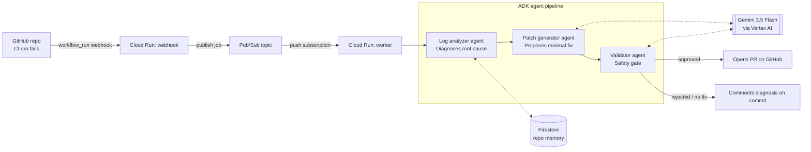

# PatchPilot architecture

## Component responsibilities

| Component | Role | GCP / Google service |
|---|---|---|
| Webhook receiver | Verifies GitHub signature, filters to failed `workflow_run` events, enqueues the job, returns fast | Cloud Run |
| Pub/Sub topic | Decouples the sub-10s GitHub webhook timeout from the multi-minute agent pipeline | Pub/Sub |
| Worker | Push-subscription endpoint that runs the full pipeline asynchronously | Cloud Run |
| Log analyzer agent | Reads flattened CI logs + past incidents, produces a structured root-cause diagnosis | ADK `Agent` + Gemini 3.5 Flash |
| Patch generator agent | Given the diagnosis and current file contents, writes a minimal targeted patch or declines | ADK `Agent` + Gemini 3.5 Flash |
| Validator agent | Adversarial second opinion — checks the patch actually matches the root cause and carries no obvious risk | ADK `Agent` + Gemini 3.5 Flash |
| Memory store | Per-repo incident history used as pipeline context, so recurring failures are recognized instead of re-diagnosed from scratch | Firestore |
| GitHub client | Fetches run logs/files, opens the fix PR, or comments the diagnosis when no safe fix exists | GitHub REST API (PyGithub) |

## Why this shape

- **Async by design**: GitHub's webhook delivery times out well before a 3-call LLM pipeline plus GitHub API round-trips can finish, so the webhook only enqueues; the actual work happens in a separate Cloud Run push-subscription worker. This satisfies the "long-running, asynchronous background execution" pattern directly.
- **Never auto-merges**: the Validator agent is a hard gate on whether a PR gets opened at all, but even an approved patch only becomes a *pull request* — a human always reviews and merges. If validation fails or the log analyzer can't diagnose the failure confidently, PatchPilot falls back to leaving a diagnostic comment instead of guessing.
- **Cross-run memory**: Firestore gives the pipeline a lightweight "Memory Bank" — recent incidents per repo are pulled into the log analyzer's prompt so a recurring flaky test or dependency conflict is recognized as a pattern, not re-derived from scratch every time.
